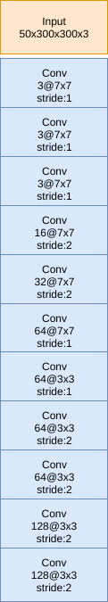

# tensorflow-vs-pytorch

This repository provides some benchmark scripts to compare the performance of CNNs in the two popular DNN frameworks, i.e. Tensorflow and PyTorch.

Tensorflow supports two form of data as the input of its convolutional layer, channels first and channels last. In the first format, data are in the form of [N, C, H, W] where N is the batch size, C is the number of channels, H is the height of matrix and W is the width of matrix. In the second format, data are in the form of [N, H, W, C]. In PyTorch only channels first data format is supported.

Both Tensorflow and PyTorch uses the cudnn library for their computations. In cudnn the data format must be in the form of channels first. Therefore, if you choose to use the channels last data format in Tensorflow, the library should change the data format to channels first and then feed this data to cudnn and then again change it to channels last to be compatible with the rest of your network. This means two extra transpose operations. In this benchmark we will investigate the performance difference between channels first and channels last data formats in both Tensorflow and PyTorch.  

## Network structure
This is a 11 layers fully convolutional neural network.

The implementations in Tensorflow and PyTorch are identical (at least as their APIs shows!).

## Experiments

For each script we perform two type of data input. In the first type we create a random tensor in each iteration and feed it to the network. This way we can examine how fast they are in conjunction with uploading an arbitrary tensor to GPU memory.

In the second type we create a tensor of ones in the GPU memory and then feed the network with this data in all iterations. This type removes the data uploading phase.

The results are shown in the following table:

| Script                   | Random data | NVidia 960M (ms) * |
|--------------------------|-------------|--------------------|
| tensorflow_channel_first | True        | 8128.48            |
| tensorflow_channel_first | False       | 2388.75            |
| tensorflow_channel_last  | True        | 8616.00            |
| tensorflow_channel_last  | False       | 2774.71            |
| torch                    | True        | 10059.49           |
| torch                    | False       | 2474.31            |

*Ubuntu 16.04 LTS, python 3.5, cuda 8.0, cudnn 5.1, tensorflow 1.3, pytorch 0.2.0
